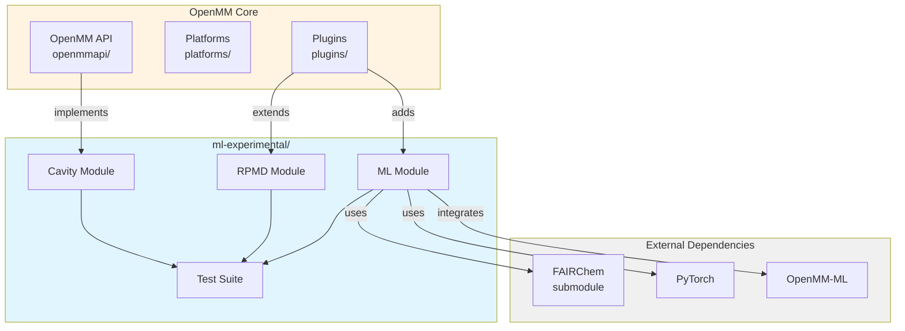
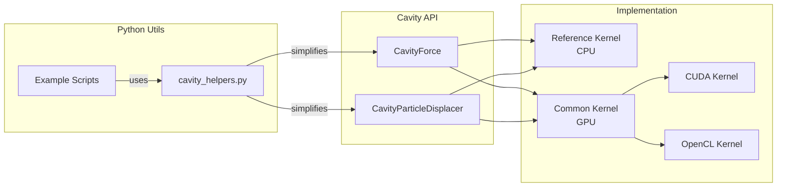
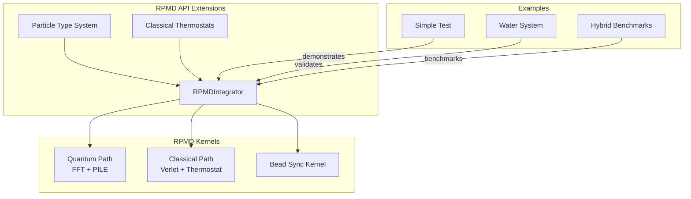
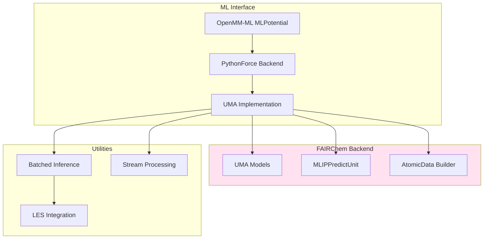
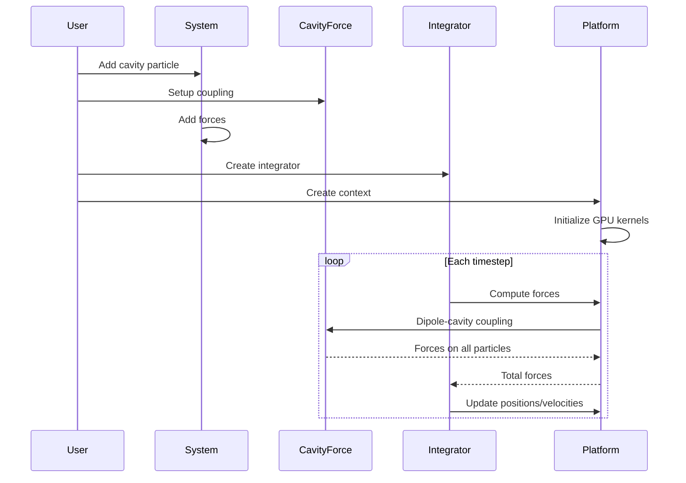
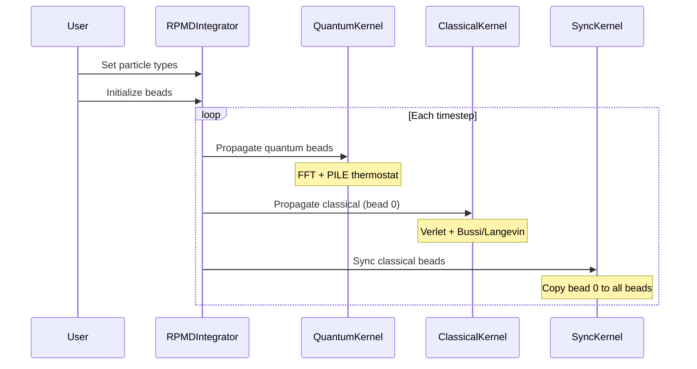
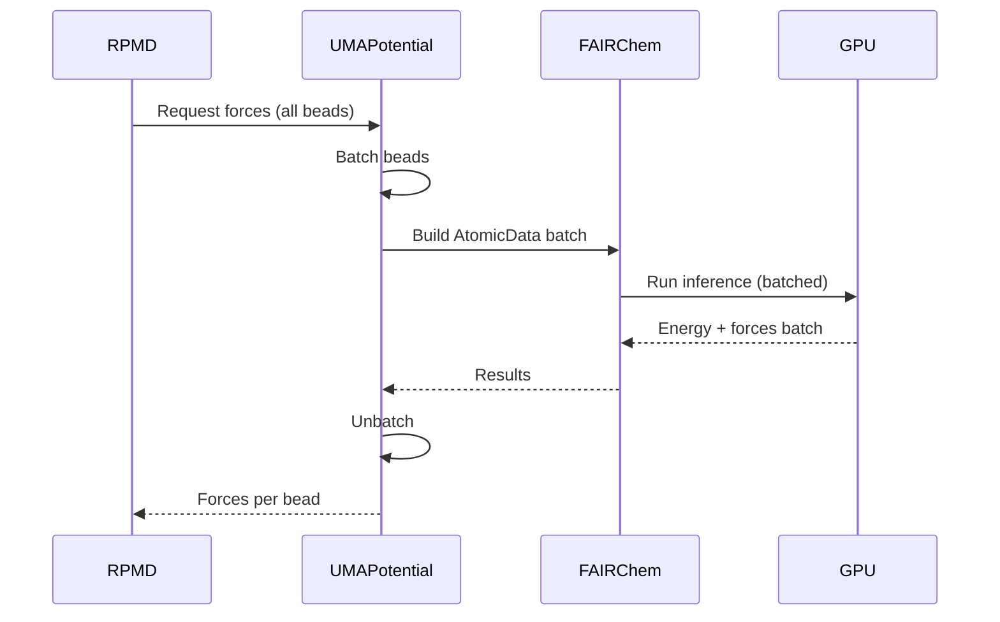

# ml-experimental Architecture Overview

This document provides a high-level overview of the architecture and organization of the ml-experimental features in OpenMM.

## Design Principles

The ml-experimental branch follows these key principles:

1. **Non-invasive**: Core OpenMM code remains unchanged; experimental features are additive
2. **Modular**: Each feature is self-contained with clear interfaces
3. **GPU-first**: All features designed for GPU acceleration from the start
4. **RPMD-compatible**: Features work seamlessly with ring polymer molecular dynamics
5. **Production-ready**: Not just prototypes - fully tested and validated implementations

## System Architecture



## Feature Modules

### 1. Cavity Particle Module

**Purpose:** Quantum light-matter coupling for polariton chemistry

**Architecture:**



**Key Components:**

- **CavityForce**: Implements dipole-cavity coupling Hamiltonian
- **CavityParticleDisplacer**: Handles finite-q corrections
- **cavity_helpers.py**: Python utilities for easy setup

**Core Files:**
- `openmmapi/src/CavityForce.cpp` (~500 lines)
- `openmmapi/src/CavityParticleDisplacer.cpp` (~400 lines)
- `platforms/common/src/CommonKernels.cpp` (cavity kernels)

### 2. Hybrid RPMD Module

**Purpose:** Selective quantum treatment for efficient simulations

**Architecture:**



**Key Components:**

- **Particle Type System**: API for marking particles as quantum/classical
- **Quantum Path**: Standard RPMD with FFT normal mode propagation
- **Classical Path**: Velocity Verlet with Bussi/Langevin thermostats
- **Bead Synchronization**: Keeps classical particle beads identical

**Core Files:**
- `plugins/rpmd/openmmapi/src/RPMDIntegrator.cpp` (+200 lines)
- `plugins/rpmd/platforms/common/src/CommonRpmdKernels.cpp` (+500 lines)
- `plugins/rpmd/platforms/common/src/kernels/rpmd.cc` (+300 lines)

### 3. ML Potential Module

**Purpose:** Integration of machine learning force fields

**Architecture:**



**Key Components:**

- **OpenMM-ML Integration**: MLPotential interface for UMA models
- **PythonForce Backend**: Python implementation for immediate usage
- **Batched Inference**: Efficient batch processing for RPMD
- **LES Integration**: Locally excited state sampling

**Core Files:**
- `fairchem/openmm-ml/openmmml/models/umapotential.py` (~300 lines)
- `fairchem/openmm-ml/openmmml/models/umapotential_pythonforce_batch.py` (~700 lines)
- `plugins/uma/` (C++ plugin, in development)

## Data Flow

### Typical Cavity Simulation



### Hybrid RPMD Simulation



### ML Potential RPMD



## Directory Organization Philosophy

The ml-experimental directory follows a **feature-based organization**:

```
ml-experimental/
├── {feature}/
│   ├── docs/       # Feature-specific documentation
│   ├── examples/   # Working examples and benchmarks
│   ├── tests/      # Feature-specific tests (optional)
│   └── utils/      # Shared utilities for feature
└── tests/          # Cross-cutting integration tests
    ├── unit/
    ├── integration/
    └── examples/
```

**Benefits:**
- Related code, docs, and tests are co-located
- Easy to navigate and understand each feature
- Clear separation of concerns
- Scalable to additional features

## Testing Strategy

Three-level testing hierarchy:

1. **Unit Tests (C++)**: Test core implementations
   - Location: Root `tests/` directory
   - Example: `tests/TestCavityForce.h`
   - Run: `make test`

2. **Integration Tests (Python)**: Test feature interactions
   - Location: `ml-experimental/tests/integration/`
   - Example: Cavity + RPMD integration
   - Run: `pytest ml-experimental/tests/integration/`

3. **Example Tests**: Full simulation examples
   - Location: `ml-experimental/{feature}/examples/`
   - Example: Water cavity dynamics
   - Run: Individual Python scripts

## Performance Considerations

### Cavity Particles

**Overhead:** ~2-5% for typical systems (>1000 atoms)

**Optimization strategies:**
- Cavity force computed once per step (not per force group)
- GPU kernels fused with standard force computation
- No explicit neighbor lists needed (long-range coupling)

### Hybrid RPMD

**Speedup:** 5-10× for systems with few quantum atoms

**Memory savings:**
- Classical particles: 1 bead vs N beads
- Typical: 50-90% memory reduction

**Optimization strategies:**
- Uniform memory layout (all particles have N beads)
- Sync kernel copies bead 0 to others (cheap on GPU)
- Quantum/classical paths fully parallel

### ML Potentials

**Inference time:** 1-5 ms/step for 100-atom systems on GPU

**Optimization strategies:**
- Batched inference for RPMD (all beads at once)
- Persistent models (no reload overhead)
- Streaming for large systems
- GPU memory sharing (zero-copy when possible)

## Extension Points

### Adding New Features

To add a new experimental feature:

1. **Create feature directory:**
   ```bash
   mkdir -p ml-experimental/new-feature/{docs,examples,utils}
   ```

2. **Implement core in appropriate location:**
   - Force: `openmmapi/src/`
   - Integrator: `plugins/{name}/`
   - Platform: `platforms/common/`

3. **Add Python utilities:**
   - Create `ml-experimental/new-feature/utils/helpers.py`

4. **Write documentation:**
   - Create `ml-experimental/new-feature/docs/`

5. **Add examples:**
   - Create `ml-experimental/new-feature/examples/`

6. **Write tests:**
   - Unit: Root `tests/`
   - Integration: `ml-experimental/tests/integration/new-feature/`

### Integration Patterns

**Pattern 1: New Force**
- Inherit from `OpenMM::Force`
- Implement platform kernels in `CommonKernels`
- Add Python wrapper with SWIG

**Pattern 2: New Integrator**
- Extend existing integrator or create plugin
- Implement GPU kernels in `platforms/common/`
- Add Python utilities for setup

**Pattern 3: ML Model**
- Integrate via OpenMM-ML `MLPotential`
- Use `PythonForce` for quick prototyping
- Optionally create C++ plugin for performance

## Future Directions

### Short-term

1. **Cavity-RPMD benchmarks**: Systematic validation
2. **Multi-cavity modes**: Extend to multiple photon modes
3. **UMA C++ plugin**: Native libtorch integration

### Long-term

1. **Hybrid QM/MM-RPMD**: Selective QM treatment
2. **Active learning**: On-the-fly ML model training
3. **Polarizable cavities**: Frequency-dependent coupling

## References

### OpenMM Architecture
- Eastman et al., "OpenMM 7: Rapid Development of High Performance Algorithms for Molecular Dynamics", PLOS Comp. Biol. 2017

### Cavity QED
- Flick et al., "Atoms and Molecules in Cavities", PNAS 2017

### RPMD
- Markland & Manolopoulos, "An Efficient Ring Polymer Contraction Scheme", JCP 2008

### Machine Learning
- FAIRChem documentation: https://fair-chem.github.io/

## Maintenance

### Code Owners

- **Cavity Particles**: Core team
- **Hybrid RPMD**: Core team
- **ML Potentials**: ML team + OpenMM-ML maintainers

### Review Process

1. All changes reviewed via pull request
2. Must pass automated tests (C++ + Python)
3. Examples must run successfully
4. Documentation updated as needed

### Backwards Compatibility

ml-experimental features maintain compatibility with:
- OpenMM 8.0+ API
- Standard OpenMM integrators
- Existing force fields and systems
- Python 3.8+

Breaking changes require major version bump.
